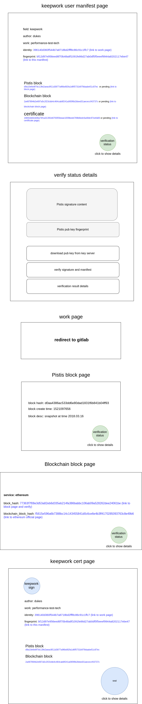

# Pistis

A server makes work trustful using BlockChain technology

> Pistis [name origin](https://en.wikipedia.org/wiki/Pistis)


## todos

技术问题
- UI
  - 页面设计，保持风格统一
  - 证书设计
- 查询页分页
- 查询页，证书页，添加日期显示
- 内部数据store，将author，pistis commit id添加中间级，负载均衡，避免同一目录下，文件太多，影响git效率
- 内部数据store，周期性将git提交github/gitlab，更新备份
- bitcoin认证的方式暂不清楚，目前有ethereum也足够


非技术问题
- 购买ether(以太币)
  - 囯内对于购买虚拟货币进行限制，没有官方的途径进行购买，没有发票
  - 国内只能通过C2C途径，没有安全保障
  - 或者转为美元，从国外市场购买
  - 购买量暂时需要 1 单位ether 即可


## 概念设计

### manifest

Pistis为数据提供凭证，证明**某时刻某数据确实存在**

manifest就是用户想要证明的数据，通过Pistis，为manifest作证

#### fingerprint

fingerprint是manifest的指纹，由manifest的内容唯一决定

理论上，不可能有不同内容的manifest拥有相同fingerprint

#### signature

签名是指Pistis用自身的名义，为**某时刻某数据存在性**的生成凭证

三个要素
- Pistis本身
- 时间要素
- 数据内容
共同决定了签名的内容

理论上，只要有一者有变动，生成的签名就截然不同

### block

在Pistis中，**某一时刻**所有manifest，fingerprint，signature的**集合**，聚合构成一个block

block由
1. manifest，fingerprint，signature的集合
2. block描述信息
3. 聚合行为发生的时间
组成，并拥有唯一的block hash标识

理论上，不可能有三项不同输入生成相同的block hash

Pistis保留所有block，根据hash标识，可以唯一定位到一个block，并索引到**那一时刻**所有manifest，fingerprint，signature的**内容**

### blockchain block

即使Pistis为manifest作证，但是Pistis没有绝对公信力（比如可能在作证时间上造假），需要借助大家公认的信任源为Pistis提供信任

公共区块链就是这个信任源，将Pistis block信息（代表所有manifest）提交至区块链区块，借助区块链证明Pistis的聚合行为

理论上
- blockchain block生成时间晚于Pistis block生成时间
- block生成时间晚于当前block包含的所有manifest被Pistis作证的时间

### certificate

上述提到的所有概念都是为了一个目的：**为用户数据提供信任**

它们一起建立了信任的链条，证书是信任链条的可视化凭证，包含
- manifest信息
- block信息
- blockchain block信息
并由Pistis唯一颁发

## 数据设计

### manifest

不同用户对manifest有不同的需要，这里希望用普适的key:value的形式来组织数据，以json来存储

对于keepwork来说，manifest需要有如下的内容

| key      | value                           | description                                                                                                                             |
|----------|---------------------------------|-----------------------------------------------------------------------------------------------------------------------------------------|
| field    | keepwork                        | 为数据划分区域，便于后续为接入其它服务提供拓展性。对于keepwork，取值为keepwork，也可能为github或者其它值。field同时决定了后续字段的内容 |
| author   | ${keepwork_user_name}           | 作者名，取值keepwork的用户名                                                                                                            |
| work     | ${keepwork_user_work_name}      | 作品名，取值keepwork用户作品网站的名字                                                                                                  |
| identity | ${keepwork_user_site_commit_id} | 唯一标识符，唯一标识作品内容，取值网站数据git存储的某个commit hash                                                                        |

Pistis在为manifest作证时，会
1. 根据key进行增序排序
2. 去格式化
3. 对manifest使用SHA256运算，生成fingerprint，并存储manifest
4. 对manifest使用GPG进行签名，并存储签名

所有manifest组织为一个git仓库，所有目录与文件按fingerprint来布局，结构为

```
  /
    05/
      58/
        31cacaa619041bd5a26766049696653e6ff45f9ee4461c8e1fc7a5b38b10
        31cacaa619041bd5a26766049696653e6ff45f9ee4461c8e1fc7a5b38b10.asc
```

fingerprint为64字节代表16进制的字符组成，分成3段
- 1-2字节
- 3-4字节
- 5-64字节

前两部分组织为目录与子目录，最后部分为文件名，存储着manifest组成的json文件

示例：

1. 请求认证的manifest

```
{
  "field": "keepwork",
  "author": "dukes",
  "work": "test-report",
  "identity": "87f90ee50c0e3e1808a7931b4ed743ecf8aa98f2"
}
```

2. 排序

```
{
  "author": "dukes",
  "field": "keepwork",
  "identity": "87f90ee50c0e3e1808a7931b4ed743ecf8aa98f2",
  "work": "test-report"
}
```

3. 去格式化

```
{"author":"dukes","field":"keepwork","identity":"87f90ee50c0e3e1808a7931b4ed743ecf8aa98f2","work":"test-report"}
```
 
4. 生成fingerprint

```
$ echo '{"author":"dukes","field":"keepwork","identity":"87f90ee50c0e3e1808a7931b4ed743ecf8aa98f2","work":"test-report"}' | sha256sum 
6f7a25580ffc9061ad5ee9c16de3ecfccd3dec5c33d87a23e78a89a09443ca08  -
```


5. 存储manifest
 
```
/
  6f/
    7a/
      25580ffc9061ad5ee9c16de3ecfccd3dec5c33d87a23e78a89a09443ca08

$ mkdir -p 9b/84
$ echo '{"author":"dukes","field":"keepwork","identity":"87f90ee50c0e3e1808a7931b4ed743ecf8aa98f2","work":"test-report"}' > 6f/7a/25580ffc9061ad5ee9c16de3ecfccd3dec5c33d87a23e78a89a09443ca08
```

6. 为manifest签名，并存储签名

```
$ gpg --armor --detach-sign  6f/7a/25580ffc9061ad5ee9c16de3ecfccd3dec5c33d87a23e78a89a09443ca08
```

### block

数据以git仓库管理，一个block是一个git commit，这就是block的本质

    $ git add .
    $ git commit -m "generate block"


每一个block的生成，也是一项行为，也作为一个manifest来存储，结构如

| key         | value        | description       |
|-------------|--------------|-------------------|
| field       | pistis/block | 标识数据域        |
| hash        |              | block的hash标识   |
| description |              | block块的描述内容 |
| timestamp   |              | block块生成的时间 |

示例：

```
{
  "field": "pistis/block",
  "hash": "d0aa4386ac533dd6e80dad1831f6b841b04ff931",
  "description": "gather all vip works",
  "timestamp": "1520994147"
}
```

### blockchain block

Pistis将block信息提交到blockchain，成为区块链一个区块的一部分

同样的，每个区块也有唯一的hash标识，
每当提交一个block，并成功写入区块，需要将block与blockchain block的对应关系记录下来

- 一个block可能没有写入blockchain block
- 一个block可能写入了多个blockchain block
- 多个block可能写入了同一个blockchain block

因此，block与chain block是多对多的关系，
为了保持简单一对一关系，要在内部机制确保
- 一个block只与一个blockchain block相对应


这种对应关系也作为一个manifest来存储，结构如

| key                   | value             | description               |
|-----------------------|-------------------|---------------------------|
| field                 | pistis/blockchain | 标识数据域                |
| service               | ethereum          | 区块链服务类型            |
| block_hash            |                   | Pistis block的fingerprint |
| blockchain_block_hash |                   | 区块链区块的hash标识      |

示例：

```
{
  "field": "pistis/blockchain",
  "service": "ethereum",
  "block_hash": "77363f7f08e3d53a82eb6d335eb214fa386babbc106ab09a528262dee24061be",
  "blockchain_block_hash": "f5615e596a6b7388bc14c143455841d0c6ce6e4b3ff4170285093763c8e49b6b"
}
```

### certificate

证书用来记录信任链

一个证书也作为一个manifest来存储，结构如

| key              | value              | description                                                                     |
|------------------|--------------------|---------------------------------------------------------------------------------|
| field            | pistis/certificate | 标识数据域                                                                      |
| manifest         |                    | manifest的fingerprint。不是manifest的内容，具体内容可以从Pistis中索取，下面同理 |
| block            |                    | Pistis block的fingerprint                                                       |
| blockchain_block |                    | blockchain block的fingerprint                                                   |

示例：
```
{
  "field": "pistis/certificate",
  "manifest": "156dc288a7de3865825b581c8981ed42e0d19f60636fb04b510ccfc2412e9911",
  "block": "96354db22b7452b5d20ec252c82fb45820d339dbe0a2f853eaf54118058ad1b4",
  "blockchain_block": "d803ef6503a975ed7c8f560d82705b60c0ad3ce9d21a0ac63b5824596d198989"
}
```

## 程序设计

Pistis通过api接口为数据作证，通过web页面来提供证书等信息

### api

- 失败的api

```
所有失败的api都返回
return
{
  "error": "${error_message}"
}
```

- 向Pistis提交manifest，进行数据作证

```
POST /api/v1/manifest

param
{
  "field": "keepwork",
  "author": "${keepwork_user_name}",
  "work": "${keepwork_user_site_name}",
  "id": "${keepwork_user_site_git_commit_id}"
}

return
{
  "field": "keepwork",
  "author": "${keepwork_user_name}",
  "work": "${keepwork_user_site_name}",
  "id": "${keepwork_user_site_git_commit_id}",
  "_meta_": {
    "fingerprint": "${fingerprint_that_gen}",
    "signature": "${signature_by_pistis}"
  }
}
```

- 查看manifest

```
GET /api/v1/manifest

param
{
  "fingerprint": "${fingerprint}"
}

return
返回的数据根据域的不同而不同，但是fingerprint与signature保持不变，keepwork的格式如下
{
  "field": "keepwork",
  "author": "${keepwork_user_name}",
  "work": "${keepwork_user_site_name}",
  "id": "${keepwork_user_site_git_commit_id}",
  "_meta_": {
    "fingerprint": "${fingerprint_that_gen}",
    "signature": "${signature_by_pistis}"
  }
}

```

- 查找manifest

```
GET /api/v1/manifest

示例：
param
{
  "field": "keepwork",
  .....
  "key": "value"
}

return
返回数据为列表
{
  "manifests": [
    {
      "field": "keepwork",
      "author": "${keepwork_user_name}",
      "work": "${keepwork_user_site_name}",
      "id": "${keepwork_user_site_git_commit_id}",
      "_meta_": {
        "fingerprint": "${fingerprint_that_gen}",
        "signature": "${signature_by_pistis}"
      }
    }
  ]
}
```
    
### page

#### 页面框架

所有页面本质上都是在呈现manifest资源，
manifest以filed来分类，目前有如下几类
- 用户提交的manifest，如keepwork
- Pistis block
- blockchain block 区块链与Pistis block对应关系
- Pistis certificate 证书

对于每一个manifest，Pistis都有相应的签名作为凭证，所以每一个页面的整体框架是
相同的，包含
- manifest信息
- Pistis 签名
- web前端提供的verify机制（由keyserver获取Pistis公钥，将数据与签名进行verify）


相应的，所有页面的url也保持一致
- 所有页面地址都是`/page/v1/manifest/:fingerprint`
  - fingerprint是manifest的指纹，Pistis由指纹索引到相应manifest，再依据field来呈现不同
    类型的页面
- 由manifest内容进行搜索`/page/v1/manifest?field=...[&key=value]`
  - 搜索必须指定field
  - 搜索可以使用多个字段，字段内容由field决定
    - 如果manifest不存在，则无结果提供
    - 如果manifest存在，提供列表供选择

#### 页面设计

- 失败页面

```
所有失败页面都返回

<h1>error</h1>
<h2>${http_code}</h2>
<p>${error_message}</p>
```

- manifest详情页

```
页面内容包括
- manifest本身

除此之外，还要呈现出manifest的信任链建立的进度
- 是否被block聚合
- 聚合其的block是否已经与blockchain建立联系
- 是否已经生成了证书
```
 
- Pistis block详情页

```
页面内容包括
- block hash值
- block生成时间
- block生成描述
```
    
- blockchain block详情页

```
页面内容包括
- blockchain使用服务
- blockchain block hash值
- block hash值
```

- Pistis证书页

```
页面内容包括
- keepwork标识
- author名称
- work名称
- work作品id
- manifest fingerprint
- Pistis block fingerprint
- blockchain block fingerprint
- 证书印章
```
    
草图如下



## 机制

### 用户方案

| 用户      | 方案             |
|-----------|------------------|
| VIP用户   | 每月一次作品认证 |
| 非VIP用户 | 每周一次作品认证 |

### 限制
数据一经认证，便存在于信任历史中，无法删除

